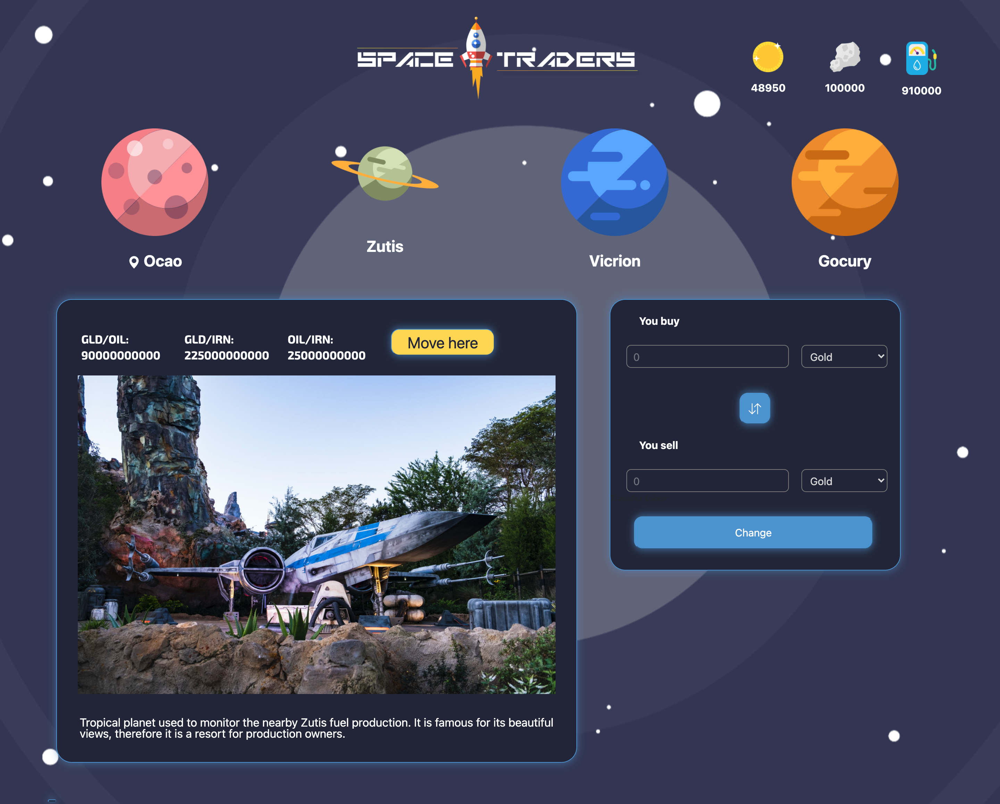
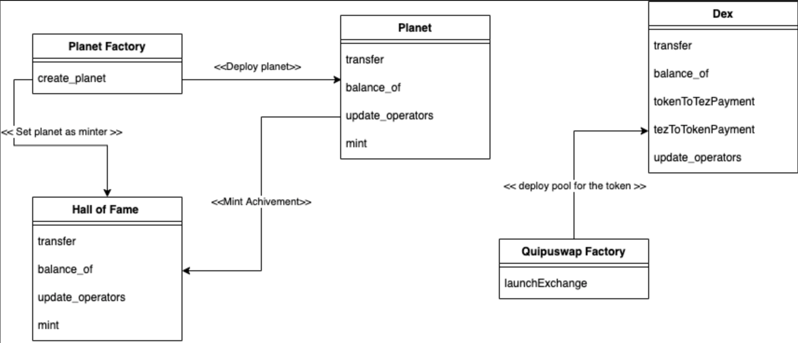

# Tezos-Hackathon-NFT-me-you-can-DAO-it — Space Traders 

<a href="https://youtu.be/KwK2moRhQto">Demo</a>

During the hackathon was implemented a prototype DeFi-game "Space Traders" for Tezos ecosystem. 

# Motivation 

In Tezos ecosystem gaming is one of the most priority trends for protocol development and popularization. Merging of NFT & DeFi technologies can attract new users to the ecosystem. Moreover, blockchain-games allow gamers to both enjoy the process and reward in cryptocurrency :)

# Core

At this moment game support 4 diferrent planets (smart-contracts), each of them with different period and in different proportion mint 3 types of resources: gold (GOLD), fuel (FUEL), iron (IRON). 

The main resource is gold (GOLD), gamers can get it by XTZ and exchange back after the game. 
Inside the game GOLD can be exchanged for fiel (FUEL) and iron (IRON). 

Fuel (FUEL) is necessary for gamers' movements between planets. One movement takes some blocks in the network and depends on a spaceship level, which gamer can upgrade for spending iron tokens (IRON). 

Each planet behaves like a UniSwap and has own liquidity pool (thanks for AMM). Liquidity pool can be changed after resource trading on a planet and depends on the nature of the planet inherent in the beginning (planet may be fuel-provider or iron-provider or provider of all types of resources in the same proportions). 

After entrance to the game and  GOLD purchase for Tezos (XTZ) gamer can earn much more GOLD by performing exchange transactions within the game (thanks AMM on each planet). 

**Example:**

- Gamer enter into the game with <X> XTZ-tokens and get <Y> GOLD-tokens. 
- Gamer exchange GOLD-tokens on IRON-tokens and FUEL-tokens for next movements between planets and upgraid his spaceship in the future. At the begin one movement costs 5 blocks. 
- Gamer choose a planet where in his opinion he can trading resources profitable. For example, on Okao planet a lot of gold and very little fuel, so thanks for AMM on this planet gamer can profitable exchage fuel on a gold. Planet Zutis specified on a fuel providing, so there is a lot of fuel here, much more than gold. Gamer can move to planet Zutis and buy cheap fuel, after that he can return to Okao and exchange fuel on gold with best course! 
- In the result gamer increased his gold-amount and he can exchange it on XTZ. 

Since the game is multiplayer, the liquidity of resources on each planet will constantly change (in view of the fact that users will constantly swap resources + resources on different planets in different proportions). The gambling interest lies in the development of strategies in which it is possible to increase the amount of GOLD-asset on the player's balance + get NFT for unlock achievements.  

# Stack of technologies
During the hackathon were implemented contracts Planet + used QuipuSwap-core for token-exchange. At the moment we exchange tokens through XTZ.  

In the future we planning improve a QuipuSwap-core for token exchange (FA2) and improve of logic of getting NFT-tokens for unlock achievements.
